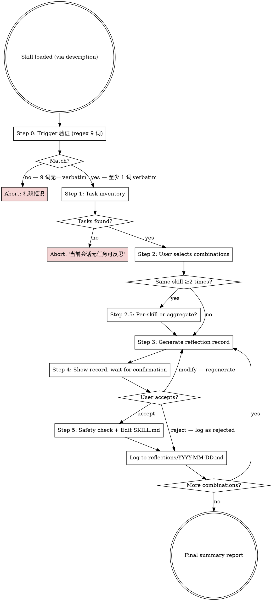
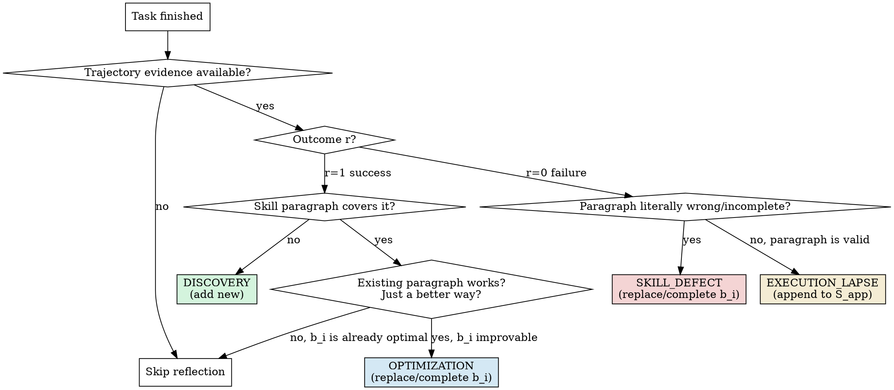

# 丰容 (Skill Enrichment) — v2 用户主动触发版

> 命名源自动物福利科学"环境丰容 (Environmental Enrichment)"——在圈养条件下,通过为动物提供多样化的环境刺激,满足其生理与心理需求,促进自然行为的展示,并减少刻板行为。本项目借用此概念,**让每一条任务轨迹都成为技能成熟的"营养"**。

> *formerly Skill-Aware Reflection — an EmbodiSkill port for Claude Code (Ju et al., 2026, arXiv:2605.10332)*
>
> *完整命名介绍见 [README.zh.md - 关于命名](./README.zh.md#关于命名) (中文) / [README.md - On the Name](./README.md#on-the-name) (English)*

> ## 📑 学术来源声明 (Attribution)
>
> **本 skill 是论文 [EmbodiSkill (Ju et al., 2026, arXiv:2605.10332)](https://arxiv.org/abs/2605.10332v1) 的工程化移植**,并非独立原创方法。
>
> ### 源论文
>
> ```
> @misc{ju2026embodiskill,
>   title        = {EmbodiSkill: Skill-Aware Reflection for Self-Evolving Embodied Agents},
>   author       = {Ju, Ruofei and Wang, Xinrui and Ding, Xin and Yang, Yifan and Wu, Hao and Jiang, Shiqi and Zhang, Qianxi and Wen, Hao and Li, Xiangyu and Wang, Meijun and Li, Kun and Liu, Yunxin and Dai, Haipeng and Wang, Wei and Cao, Ting},
>   year         = {2026},
>   eprint       = {2605.10332},
>   archivePrefix= {arXiv},
>   primaryClass= {cs.AI},
>   note         = {Corresponding author: Cao, Ting (tingcao@mail.tsinghua.edu.cn)}
> }
> ```
>
> **正文引用形式**:`Ju et al. (2026, arXiv:2605.10332)`
>
> ### 本仓库的边界
>
> | 来源 | 内容 |
> |---|---|
> | **直接来自论文** | 四类反思框架(Discovery/Optimization/SkillDefect/ExecutionLapse)、`S = (S_body, S_app)` 结构、反思记录字段(`type`/`evidence`/`b_i`/`directive`)、分类逻辑(成功路径/失败路径)、`literal comparison` 思路 |
> | **本仓库的工程化贡献** | (1) graphviz 决策树(将论文决策表结构化);(2) Discipline/Anti-patterns 表、Red Flags、Common Mistakes、Self-Test 等运维检查项;(3) Quick Algorithm 伪代码(论文 Algorithm 1 的紧凑重写);(4) 6 个基于 Claude Code 工具链的原创 examples(论文中的冰水/热水示例**未被复用**);(5) reflection-record 模板与提交规范 |
> | **应用领域转换** | 论文:embodied agents (ALFWorld/EmbodiedBench) → 本 skill:Claude Code 程序性 skill 场景 |
> | **v2 增量** | (6) 用户主动触发(3 主触发词 + 3 衍生同义 + 英文等价);(7) 列表式多任务盘点 + 用户多选组合;(8) 确认门控(先生成 record,用户确认后才改文件);(9) 改前安全检查(b_i 唯一匹配 + 行数变化 ≤ 50%) |
>
> ### 概念对应表(完整版)
>
> 见 [README.zh.md - 与 EmbodiSkill 论文的对应](./README.zh.md#与-embodiskill-论文的对应)
>
> ---
>
> **使用本 skill 即视为接受**:核心方法论归属论文作者;若在学术或商业场景中引用本 skill,需同时引用 EmbodiSkill 原论文。

## Overview

v2 把"反思"从**被动事后触发**改为**用户主动触发+多任务盘点**。一次会话里你可能跑过 `contract-review`、`database-migration`、`pdf-processing` 等多个 skill,有些快有些慢有些失败——**当你说"反思技能"时**,本 skill 会:

```
扫描当前会话所有已执行任务
    → 列出 (任务摘要, 涉及 skill) 让你挑
    → 对每组生成 reflection record(Discovery/Optimization/SkillDefect/ExecutionLapse)
    → 给你看 record,**不直接改文件**
    → 等你确认后才 Edit SKILL.md
```

**核心原则**(沿用 EmbodiSkill):
- **不要全文重写 skill**——只改一个 `b_i` 段落
- 分类必须锚定到 SKILL.md 的 verbatim 引用
- 改前必走"literal comparison"判断

## Trigger Words(精确字符串匹配)

| 类别 | 触发词 |
|---|---|
| 主触发词 | 反思技能 / 进化技能 / 优化技能 |
| 衍生同义 | 复盘技能 / 丰容技能 / 技能复盘 |
| 英文等价 | reflect on skill / evolve skill / optimize skill |

**触发条件**:用户 query 包含任一触发词(在普通文本中,**不在**代码块/字符串字面值内)→ 立即加载本 skill 并启动 Step 1。

**不触发场景**(避免误触发):

| 场景 | 示例 |
|---|---|
| 改 SKILL.md 的内容创作任务 | "帮我改一下 Skill-Enrichment 的描述" |
| 写新 skill | "帮我写个新 skill 处理 Excel" |
| 解释 skill 本身 | "Skill-Enrichment 是什么?" |
| 反思非 skill 的过程(任务、代码、决策) | "反思一下刚才的部署过程" / "反思下我的投资逻辑" |
| 反思个人行为/情绪 | "反思下我为什么拖延" |

---

## Step 0 — Trigger 验证(必走,加载后第一道关)

收到 query 后,**先做 verbatim 机械检查** — 9 个触发词必须出现至少 1 个(允许标点环绕,例如 `反思技能,` 或 `反思技能。` 都算命中)。

**不满足** → **礼貌拒识**,**不进入** Step 1,例如回复:

> 我是丰容 skill。需要你显式说 `反思技能` / `进化技能` / `优化技能` / `复盘技能` / `丰容技能` / `技能复盘` (或英文 `reflect on skill` / `evolve skill` / `optimize skill`) 才会启动。

**满足** → 进入 Step 1 任务盘点。

**为什么需要 Step 0**:

| 痛点 | 解决方式 |
|---|---|
| Claude 看到 query 字面含 `Skill-Enrichment` 就触发(无论 description 怎么写),例如 `帮我改 Skill-Enrichment 的 SKILL.md` / `Skill-Enrichment 是什么?` | body 层做 regex 机械判断,只允许 9 个 trigger phrase 命中 |
| v2 spec 的"用户主动触发"契约只在 description 层守 | 在 body 层加显式 gate,契约双层守护 |
| 调 description 是描述语义,噪声大(5-runs ±1-2 pass) | 机械匹配是确定性判断,零噪声 |

**位置关系**:
- `description` 负责"让 Claude 想到加载本 skill"(语义层)
- `Step 0` 负责"加载后是否真的进入流程"(机械层)
- 两者协同:description 提高 recall,Step 0 压低 FP

---

## The Flow(6 步流水线: 0 → 1 → 2 → 2.5 → 3 → 4 → 5)



### Step 1 — 任务盘点(Task Inventory)

> **前置条件**:Step 0 Trigger 验证已通过(query 含 9 个 trigger phrase 至少 1 个)。

从当前会话上下文中提取:

| 字段 | 来源 | 必填 |
|---|---|---|
| 任务序号(1, 2, 3...) | 顺序 | 必填 |
| 任务摘要(≤ 30 字) | LLM 从用户/agent 对话中归纳 | 必填 |
| 涉及 skill 列表(`` `xxx-skill` ``) | 任务描述中显式引用 | 必填 |
| 任务结果 | success / partial / fail / unknown | 可选 |
| 任务耗时 | 时间戳差 | 可选 |

**展示格式**:

```
当前会话已执行任务(共 N 个):

  #1 [partial] 审查 NDA 合同 | skill: contract-review
  #2 [success] 部署前端 | skill: frontend-design
  #3 [fail]    跑 OCR 提取扫描 PDF | skill: pdf-processing
  #4 [success] 重构数据库迁移脚本 | skill: database-migration
  ...

请挑要反思的 (任务, skill) 组合(多选):
  [ ] #1:contract-review
  [ ] #2:frontend-design
  [ ] #3:pdf-processing
  [ ] #4:database-migration
```

**任务数 = 0**:立即中止,提示"当前会话无任务可反思"。
**任务数 > 20**:提示用户先筛选("全部 / 最近 5 / 指定时间范围")。

### Step 2 — 用户挑选

用 `AskUserQuestion` 多选模式(最多 4 选项 + Other)。若 > 4 组,先按 skill 聚合再展示。

### Step 2.5 — 聚合 vs 逐个

若用户选了同一 skill 的 ≥ 2 个任务,询问:

| 选项 | 行为 |
|---|---|
| 逐个 | 每个 (任务, skill) 组合走一次四类框架,产出独立 reflection record |
| 聚合 | 合并所有任务的证据,产出**一个** reflection record 共享同 SKILL.md 章节 |

### Step 3 — Reflection Record 生成

对每个组合,按 EmbodiSkill 四类框架(Discovery/Optimization/SkillDefect/ExecutionLapse)分类。详见 [The Reflection Record](#the-reflection-record)。

### Step 4 — 用户确认门

**绝对禁止**在用户确认前调用 Edit/Write。展示 record 后,给三个选项:

| 选项 | 动作 |
|---|---|
| 采纳 | 进入 Step 5 |
| 拒绝 | 写日志(rejected),不修改文件,继续下一组合 |
| 修改后采纳 | 收集修改意见,重生成 record,回到 Step 3 |

### Step 5 — 改前安全检查 + Edit

执行 Edit/Write **前**,逐项验证:

| 检查项 | 失败行为 |
|---|---|
| `b_i` 在 SKILL.md 中**唯一**匹配(`grep -c` = 1) | 提示用户手动定位,不动文件 |
| 改后 SKILL.md 行数变化 ≤ 50% | 提示"疑似全文重写,需用户二次确认" |
| 目标 `directive` 是四个枚举值之一 | 拒绝执行,提示逻辑错误 |

**通过检查**后,执行 Edit,记录 `b_i` 旧值到日志(便于回滚)。

---

## Quick Reference: Four-Type Decision



---

## The Reflection Record

每条 record 严格使用以下字段。**One record, one type.**

| 字段 | 必填 | 含义 |
|---|---|---|
| `type` | 是 | `DISCOVERY` / `OPTIMIZATION` / `SKILL_DEFECT` / `EXECUTION_LAPSE` |
| `evidence` | 是 | 任务轨迹中真实摘录的 1-3 行(动作/观察/错误) |
| `target_skill_content b_i` | 是(除 DISCOVERY) | 目标 SKILL.md 段落的 **verbatim 引用**;DISCOVERY 留空 |
| `directive d_i` | 是 | 四个枚举值之一:`REPLACE b_i WITH <new>` / `COMPLETE b_i WITH <addendum>` / `APPEND <new paragraph>`(DISCOVERY)/ `APPEND_TO_APPENDIX <reminder>`(EXECUTION_LAPSE) |
| `new_content` | 视 directive | 替换/补全/新段落/附录提醒的内容 |

**输出格式**(给用户审阅用):

```
[REFLECTION: <TYPE>]
evidence: <...>
target_skill_content b_i: "<verbatim>"
directive: <REPLACE|COMPLETE|APPEND|APPEND_TO_APPENDIX>
new_content: <...>
```

---

## How to Read the Decision Table

从图顶开始,逐项回答。**不要跳步。**每个分支是强制的——没有"通用重写"选项。

### Success Path (r=1)

1. 任务是否用了 SKILL.md **没覆盖**的能力? → **DISCOVERY**(添加新段落,`b_i` 留空)
2. 否则:现有段落能用,但有更优写法? → **OPTIMIZATION**(`REPLACE` 或 `COMPLETE`)
3. 否则:skill 已最优,无需 record

### Failure Path (r=0) — literal comparison

1. 引述相关 skill 段落(`b_i`)
2. 引述 agent 实际动作序列
3. skill 说 X,agent 没做 X 因为没读/没遵循? → **EXECUTION_LAPSE**
4. skill 说 X,但 X 本身错/漏/不充分(即使完美遵循也会失败)? → **SKILL_DEFECT**
5. skill 对 + agent 跟了 + 还失败? → **ESCALATE**(超出 skill 范围,不改)

---

## Skill Structure: S = (S_body, S_app)

| 部分 | 由谁修改 | 永不被谁修改 |
|---|---|---|
| `S_body`(主体) | DISCOVERY(append)/ OPTIMIZATION / SKILL_DEFECT | EXECUTION_LAPSE |
| `S_app`(执行提醒) | EXECUTION_LAPSE(append/merge) | DISCOVERY/OPT/SKILL_DEFECT |

**这是框架的核心**。混淆两者的反模式:把 ExecutionLapse 写进 body → 段落被改写 → 下次看起来像 SkillDefect → 进一步重写 → skill 面目全非。

---

## Discipline (Anti-Patterns)

| 反模式 | 失败原因 | 正确做法 |
|---|---|---|
| 任何信号都全文重写 skill | 丢失已工作部分;重复内容;改写有效指导 | 始终锚定 `b_i` verbatim,选离散 directive |
| "skill 太笼统,我来全部澄清" | 笼统是症状,真实缺陷在特定段落 | 找到具体段落,只改那一个 |
| 加投机性 "要不要支持 X" 无证据 | 污染 skill;新内容未经验证 | 等到任务真触发 X 时,再记 DISCOVERY |
| "agent 没仔细读" 写进 SKILL_DEFECT | 混淆执行失败和 skill 失败;改写有效 skill | 用 EXECUTION_LAPSE:append 到附录 |
| "skill 漏了" 写进 EXECUTION_LAPSE | 缺陷永远修不了,下次再失败 | 用 SKILL_DEFECT:replace/complete |
| 一条 record 混 Discovery + Optimization | 不清改了什么;部分状态;难回滚 | 拆成多条,每条一类 |
| 重复 ExecutionLapse 时忘更新 S_app | 同样错误再发生;附录空着 | 每条 EXECUTION_LAPSE 都 APPEND_TO_APPENDIX |

---

## Red Flags — Stop and Re-classify

- [ ] 写 record 但没有 `b_i` verbatim 引用(除 DISCOVERY)
- [ ] directive 用了 "rewrite"/"improve"/"clarify"/"tidy up"
- [ ] 失败后改 S_body 但没先检查 agent 是否跟了 skill
- [ ] 给 S_app 加新规则(而不是提醒)
- [ ] 加进 skill 的内容无任何任务触发过
- [ ] 单条 record 混合多个反思类型
- [ ] 失败后说 "skill 没问题,不用反思"

任一勾选 → 停下重跑决策树。

---

## Anti-Rationalization Table

| 借口 | 现实 |
|---|---|
| "skill 没问题,就这一次失败" | 失败会聚集,正确分类才能防止再发生 |
| "整个 skill 该刷一遍" | 合理化粗暴重写,找具体段落 |
| "没时间分类,先打个补丁" | 错误分类(把 Lapse 标成 Defect)比不修更糟 |
| "Discovery 就是吹个牛" | Discovery 要轨迹证据,投机是污染 |
| "附录就是 clutter" | 附录是给 Lapse 用的,放 "段落有效,请遵循" 才对 |
| "下次再修" | 框架的价值在当下,跳过就丢了结构化信号 |
| "多类型重叠,难拆" | 拆,混合 record 不可执行 |

---

## Common Mistakes

**Mistake 1: Discovery 无证据**
给 Mermaid skill 加 "支持 ER 图" 因为 "可能有用"。无任务触发过 ER 图。投机加的段落未验证。

*Fix*: DISCOVERY 需轨迹证据显示 agent 用了 skill 没提的过程。无证据,不加。

**Mistake 2: SkillDefect when skill 实际无问题**
任务失败。skill 说"调用 API X 验证"。agent 调了,API X 返 500。agent 把 skill 改成"调 API Y"。

*Fix*: skill 正确,失败在 API/环境层。归类 ESCALATE(超出 skill 范围),**不**改 skill。

**Mistake 3: ExecutionLapse for 缺失段落**
任务失败。skill 没提 API 返 500 怎么办。agent 跳过处理,重跑。

*Fix*: skill 缺段落(是 defect 不是 lapse)。归类 SKILL_DEFECT + `APPEND` 新段落。

**Mistake 4: 全文重写伪装成 Optimization**
任务成功但耗时 5x。record 写 `OPTIMIZATION` + directive "streamline the whole procedure"。

*Fix*: 找具体段落。引为 `b_i`。只改那一段。**不**重写整流程。

---

## Quick Algorithm (v3 — 含 Step 0)

```
INPUT:  user query Q,
        current session tasks T = {t_1, ..., t_n}
OUTPUT: zero or more reflection records per (t, s) pair, with SKILL.md updates after confirmation

0. Trigger 验证 — verbatim regex 检查 Q 是否含 9 个 trigger phrase 任一
   不满足 → abort 礼貌拒识(返回 trigger phrase 列表给用户)
   满足 → 继续 Step 1
1. Scan session context → build T with (summary, skills_used, result) per task
2. Present T to user → user selects C
3. If ∃ s selected ≥ 2 times → ask per-skill vs aggregate
4. For each (t, s) in C:
     a. Read current SKILL.md (s)
     b. Apply four-type decision (literal comparison on t's trajectory)
     c. Build reflection record
     d. Show record to user → wait for explicit accept/reject/modify
     e. If accept: run safety check (b_i unique / line-change ≤ 50% / directive enum)
        If pass: Edit SKILL.md, log to reflections/YYYY-MM-DD.md
        If fail: halt and ask user
     f. If reject: log as rejected, continue
     g. If modify: collect notes, go to 4b
5. Return summary: "X records accepted, Y rejected, Z modified, W pending"
```

---

## Output Format

**Step 4 用户审阅时**的 record 呈现:

```
─── Reflection record #1 / N ───
任务:    #3 [fail] 跑 OCR 提取扫描 PDF
Skill:   pdf-processing
类型:    SKILL_DEFECT(失败 + skill 段落错/漏)

evidence:
  - "Read tool 调用 page 1,返回 'image-only, no text layer detected'"
  - "skill 当前内容里没有任何 OCR fallback 路径"

target_skill_content b_i:
  "## 提取 PDF 文本\n使用 Read 工具逐页读取 PDF 文本。\n如果 Read 工具返回非文本内容,转用 pdfplumber 提取。"

directive: COMPLETE b_i WITH <addendum>

new_content:
  "## 提取 PDF 文本\n使用 Read 工具逐页读取 PDF 文本。\n如果 Read 工具返回非文本内容,转用 pdfplumber 提取。\n**扫描件/纯图片 PDF**:Read 工具返回 'image-only' 时,转用 tesseract OCR(`tesseract <page>.png <page> -l chi_sim+eng`),再 Read `<page>.txt` 拿文本。"

[ ] 采纳(改文件)
[ ] 拒绝(只记录)
[ ] 修改后采纳
```

---

## Self-Test

**Record 生成前**(mental check):

1. 引述 `b_i` 是 SKILL.md verbatim 吗?否则停。
2. 恰好选了一类吗?否则拆。
3. evidence 来自实际任务而非假设?否则停。
4. success path:删掉这条 record,skill 会变吗?不会 → 不该生成。
5. failure path:完美 agent 遵循 skill verbatim 会成功吗?会 → SKILL_DEFECT;不会但 skill 对 → EXECUTION_LAPSE。

**Step 5 Edit 前**(自动化检查):

| 检查 | 失败处理 |
|---|---|
| `grep -c "$b_i" SKILL.md` = 1 | 提示用户手动定位,不动文件 |
| 新行数 vs 旧行数 \|diff\| ≤ 50% | 提示"疑似全文重写",需用户二次确认 |
| directive ∈ {REPLACE, COMPLETE, APPEND, APPEND_TO_APPENDIX} | 拒绝执行,提示逻辑错误 |

---

## Appendix — Audit Log Format

每次反思(无论采纳与否)写入 `~/.claude/skills/Skill-Enrichment/reflections/YYYY-MM-DD.md`:

```yaml
---
date: 2026-06-03
session: <session-id-if-available>
---

# Reflection #1

- **time**: 18:45:12
- **task**: #3 [fail] 跑 OCR 提取扫描 PDF
- **skill**: pdf-processing
- **type**: SKILL_DEFECT
- **status**: accepted
- **directive**: COMPLETE b_i WITH <addendum>
- **b_i_old** (snapshot for rollback):
  "## 提取 PDF 文本\n使用 Read 工具逐页读取 PDF 文本。\n如果 Read 工具返回非文本内容,转用 pdfplumber 提取。"
- **b_i_new**:
  "## 提取 PDF 文本\n使用 Read 工具逐页读取 PDF 文本。\n如果 Read 工具返回非文本内容,转用 pdfplumber 提取。\n**扫描件/纯图片 PDF**:Read 工具返回 'image-only' 时,转用 tesseract OCR..."

# Reflection #2 (rejected)
- **time**: 18:47:30
- **task**: #1 [partial] 审查 NDA 合同
- **skill**: contract-review
- **type**: OPTIMIZATION
- **status**: rejected
- **user_note**: "先不改,等更多数据"
```

**回滚指引**:用 `b_i_old` + git 找对应 commit,执行 `git diff -R` 或手工恢复。
