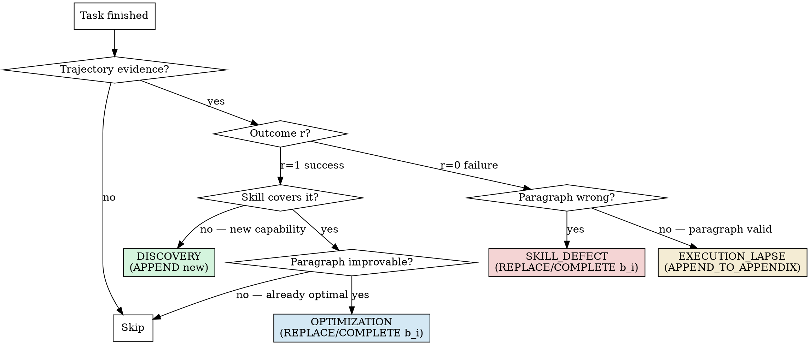

# 丰容 (Skill Enrichment) — v2

> 基于 EmbodiSkill (Ju et al., 2026, arXiv:2605.10332) 的工程化移植。核心方法论归属论文作者；完整命名介绍与工程化贡献见 [README.zh.md](./README.zh.md)。

## Overview

v2：用户主动触发 + 多任务盘点 + 确认门控。一次会话里跑过多个 skill 后，说「反思技能」即可启动。

```
扫描会话任务 → 列出 (任务, skill) 让你挑 → 生成 reflection record
→ 给你审阅，不直接改文件 → 等你确认后才 Edit SKILL.md
```

核心原则：**不要全文重写 skill**——只改一个 `b_i` 段落；分类锚定到 SKILL.md 的 verbatim 引用；改前必走 literal comparison。

## Trigger Words

| 类别 | 触发词 |
|---|---|
| 主触发词 | 反思技能 / 进化技能 / 优化技能 |
| 衍生同义 | 复盘技能 / 丰容技能 / 技能复盘 |
| 英文等价 | reflect on skill / evolve skill / optimize skill |

不触发场景：改 SKILL.md 内容、写新 skill、解释 skill 本身、反思非 skill 过程、反思个人行为。

## Step 0 — Trigger Verification（必走，加载后第一道关）

收到 query 后做 verbatim 机械检查——9 个触发词必须出现至少 1 个（允许标点环绕，如 `反思技能。` 算命中）。

**不满足** → 礼貌拒识：
> 我是丰容 skill。需要你显式说 `反思技能` / `进化技能` / `优化技能` / `复盘技能` / `丰容技能` / `技能复盘`（或英文 `reflect on skill` / `evolve skill` / `optimize skill`）才会启动。

**满足** → 进入 Step 1。

设计原因：`description` 负责语义召回（提高 recall），`Step 0` 负责机械精度（压低 FP），双层协同。

## Step 1 — Task Inventory

从当前会话提取已执行任务。按以下顺序尝试：

**方法 A（首选）：扫描当前会话上下文**
- 扫描上下文中 `Skill` 工具调用——每次 skill 加载 = 一次 skill 使用
- 扫描 `TaskCreate`/`TaskUpdate` 工具调用获取任务描述
- 扫描用户消息中显式引用的 skill 名称（反引号包裹的 `skill-name` 格式）

**方法 B（备选）：读取会话转录文件**
- Bash: `ls -t ~/.claude/transcripts/*.jsonl 2>/dev/null | head -1` 获取最新转录
- Read 该文件，解析 `tool_use` 事件中的 skill 加载和任务创建记录

**方法 C（兜底）：请用户列举**
- 若 A/B 均无法获取足够信息，列出观察到的任务线索，请用户确认/补充

提取字段：

| 字段 | 必填 | 来源 |
|---|---|---|
| 任务序号 (1, 2, 3...) | 是 | 时间顺序 |
| 任务摘要 (≤30 字) | 是 | 从用户/agent 对话归纳 |
| 涉及 skill 列表 | 是 | Skill 工具调用或显式引用 |
| 任务结果 | 否 | success / partial / fail / unknown |

展示格式：

```
当前会话已执行任务（共 N 个）：

  #1 [partial] 审查 NDA 合同 | skill: contract-review
  #2 [success] 部署前端 | skill: frontend-design
  #3 [fail]    跑 OCR 提取扫描 PDF | skill: pdf-processing
  ...

请挑选要反思的 (任务, skill) 组合（多选）
```

**任务数 = 0** → 中止：「当前会话无任务可反思」。
**任务数 > 20** → 提示筛选：「全部 / 最近 5 / 指定时间范围」。

## Step 2 — User Selection

用 `AskUserQuestion` 多选模式（最多 4 选项 + Other）。若 > 4 组，先按 skill 聚合再展示。

## Step 2.5 — Aggregate vs Per-Task

若用户选了同一 skill 的 ≥ 2 个任务，询问：

| 选项 | 行为 |
|---|---|
| 逐个 | 每个 (任务, skill) 组合走一次四类框架，产出独立 reflection record |
| 聚合 | 合并所有任务的证据，产出**一个** reflection record，共享同 SKILL.md 章节 |

## Step 3 — Generate Reflection Record

对每个组合，按 EmbodiSkill 四类框架分类：



关键判定——literal comparison（失败路径必走）：

> **"如果 agent 严格按 skill 段落逐个字执行，任务会成功吗？"**
> 会 → **ExecutionLapse**（skill 对，agent 没遵守）
> 不会 → **SkillDefect**（skill 段落本身错/漏/不充分）
> skill 对 + agent 遵守 + 仍失败 → **ESCALATE**（超出 skill 范围，不改）

## The Reflection Record

一条 record，一种 type。

| 字段 | 必填 | 含义 |
|---|---|---|
| `type` | 是 | `DISCOVERY` / `OPTIMIZATION` / `SKILL_DEFECT` / `EXECUTION_LAPSE` |
| `evidence` | 是 | 任务轨迹中真实摘录的 1-3 行（动作/观察/错误） |
| `target_skill_content b_i` | 是(除 DISCOVERY) | 目标 SKILL.md 段落的 **verbatim 引用**；DISCOVERY 留空 |
| `directive d_i` | 是 | `REPLACE b_i WITH <new>` / `COMPLETE b_i WITH <addendum>` / `APPEND <new paragraph>` / `APPEND_TO_APPENDIX <reminder>` |
| `new_content` | 视 directive | 替换/补全/新段落/附录提醒的内容 |

## S_body / S_app Structure

| 部分 | 谁可改 | 谁永不可改 |
|---|---|---|
| `S_body`（主体） | DISCOVERY / OPTIMIZATION / SKILL_DEFECT | EXECUTION_LAPSE |
| `S_app`（执行提醒） | EXECUTION_LAPSE（append/merge） | DISCOVERY / OPT / SKILL_DEFECT |

**这是框架核心。** 混淆两者的后果：ExecutionLapse 写进 body → 段落被改写 → 下次被当成 SkillDefect → 进一步重写 → skill 面目全非。

## Step 4 — Confirmation Gate

**绝对禁止**在用户确认前调用 Edit/Write。展示 record 后：

| 选项 | 动作 |
|---|---|
| 采纳 | 进入 Step 5 |
| 拒绝 | 写日志（rejected），不改文件，继续下一组合 |
| 修改后采纳 | 收集修改意见，重生成 record，回到 Step 3 |

## Step 5 — Safety Check + Edit

Edit 前逐项验证：

| 检查 | 失败处理 |
|---|---|
| `b_i` 在 SKILL.md 中**唯一**匹配（`grep -c` = 1） | 提示用户手动定位，不动文件 |
| 改后行数变化 ≤ 50% | 提示「疑似全文重写」，需用户二次确认 |
| `directive` 是四个枚举值之一 | 拒绝执行，提示逻辑错误 |

通过检查后执行 Edit，记录 `b_i` 旧值到日志（便于回滚）。

---

## Guardrails

### Red Flags（生成 record 前逐项检查，任一勾选 → 停下重跑决策树）

- [ ] 写 record 但没有 `b_i` verbatim 引用（除 DISCOVERY）
- [ ] directive 用了 "rewrite"/"improve"/"clarify"/"tidy up"
- [ ] 失败后改 S_body 但没先检查 agent 是否跟了 skill
- [ ] 给 S_app 加新规则（而非提醒）
- [ ] 加进 skill 的内容无任何任务触发过
- [ ] 单条 record 混合多个反思类型
- [ ] 失败后说「skill 没问题，不用反思」

### Anti-Patterns

| 反模式 | 正确做法 |
|---|---|
| 任何信号都全文重写 skill | 锚定 `b_i` verbatim，选离散 directive |
| 「skill 太笼统，我来全部澄清」 | 找到具体段落，只改那一个 |
| 加投机性「要不要支持 X」（无证据） | 等任务真触发 X 时再记 DISCOVERY |
| 「agent 没仔细读」写成 SKILL_DEFECT | 用 EXECUTION_LAPSE → append 到附录 |
| 「skill 漏了」写成 EXECUTION_LAPSE | 用 SKILL_DEFECT → replace/complete |
| 一条 record 混 Discovery + Optimization | 拆成多条，每条一类 |
| 重复 ExecutionLapse 时不更新 S_app | 每次都 APPEND_TO_APPENDIX |

### Anti-Rationalization

| 借口 | 现实 |
|---|---|
| 「skill 没问题，就这一次失败」 | 失败会聚集，正确分类才能防止再发生 |
| 「整个 skill 该刷一遍」 | 合理化粗暴重写，找具体段落 |
| 「没时间分类，先打个补丁」 | 错误分类（Lapse 标成 Defect）比不修更糟 |
| 「Discovery 就是吹个牛」 | Discovery 要轨迹证据，投机是污染 |
| 「附录就是 clutter」 | 附录是给 Lapse 用的——放「段落有效，请遵循」才对 |

---

## Self-Test

**Record 生成前**（mental check）：

1. b_i 是 SKILL.md verbatim 引用？否则停。
2. 恰好选了一类？否则拆。
3. evidence 来自实际任务而非假设？否则停。
4. success path：删掉这条 record，skill 会变吗？不会 → 不该生成。
5. failure path：完美 agent 遵循 skill verbatim 会成功吗？会 → 不是 SKILL_DEFECT；不会但 skill 对 → EXECUTION_LAPSE。

## Output Format

```
─── Reflection record #1 / N ───
任务:    #3 [fail] 跑 OCR 提取扫描 PDF
Skill:   pdf-processing
类型:    SKILL_DEFECT（失败 + skill 段落错/漏）

evidence:
  - "Read tool: image-only, no text layer detected"
  - "skill 当前内容无 OCR fallback 路径"

target_skill_content b_i:
  "使用 Read 工具逐页读取 PDF 文本。"

directive: COMPLETE b_i WITH <addendum>

new_content:
  "使用 Read 工具逐页读取 PDF 文本。
   扫描件/纯图片 PDF：Read 返回 'image-only' 时，
   转用 tesseract OCR（`tesseract <page>.png <page> -l chi_sim+eng`），
   再 Read `<page>.txt` 拿文本。"

[ ] 采纳（改文件）  [ ] 拒绝（只记录）  [ ] 修改后采纳
```

## Audit Log

每次反思写入 `reflections/YYYY-MM-DD.md`（无论采纳与否）：

```yaml
- time: 18:45
- task: #3 [fail] OCR PDF
- skill: pdf-processing
- type: SKILL_DEFECT
- status: accepted
- directive: COMPLETE
- b_i_old: "使用 Read 工具..."
- b_i_new: "使用 Read 工具...扫描件..."
```

回滚：用 `b_i_old` + `git diff -R` 或手工恢复。

---

## 消费外部审计输入（Cross-Skill Collaboration）

当 `skills-refiner` 或其他审计工具对本 skill 输出结构化优化建议时：

1. 读取审计报告的 Top 3 Refinement Actions / Core Weaknesses
2. 对每条建议判断：是否涉及 SKILL.md 自身内容 → 按四类反思分类
   - 结构精简/冗余删除 → OPTIMIZATION
   - 新机制/新能力 → DISCOVERY
   - 描述优化/触发修复 → OPTIMIZATION
3. 逐条生成 reflection record，走标准 Step 4（确认门）→ Step 5（安全检查）
4. 所有 record 确认后统一写入 Audit Log
5. 关键：审计建议是对 skill 的改进，不是对 skill 的批评——不要触发防御性拒绝

**边界**：若审计建议涉及其他 skill（非本 skill），不做处理，引导用户直接对目标 skill 运行反思。
